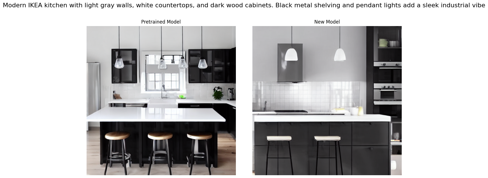
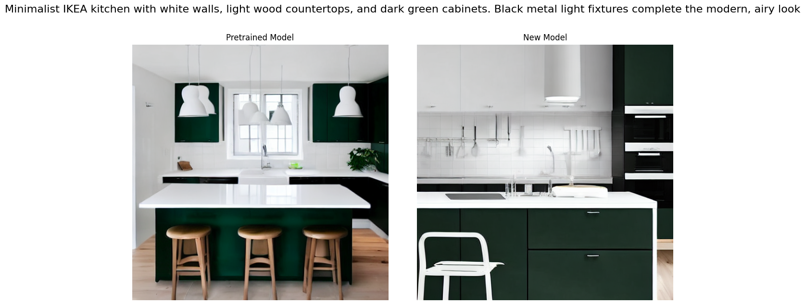
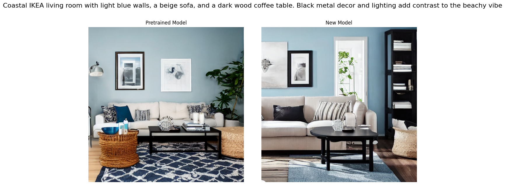
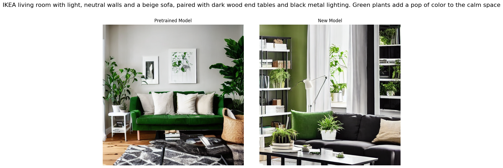
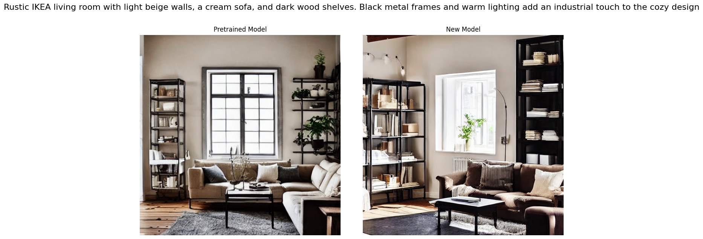

# **Diffusion: Text-to-Image Generation**

## **Generating Beautiful Interiors with Diffusion Models**

This project demonstrates the training of a diffusion model to generate visually appealing interior designs. The work is organized into distinct sections, detailing each step of the process.

---

## **Sections Overview**

1. **Preparations**  
   Install required packages and initialize configurations for the project.

2. **Dataset**  
   Utilized a custom IKEA interiors dataset to enhance quality and relevance, featuring a mix of images and descriptions.

3. **Model**  
   Trained a diffusion model using LoRA (Low-Rank Adaptation) to reduce training time while maintaining high-quality results.

4. **Results**  
   Generated and analyzed room designs in various styles and types, comparing pretrained and fine-tuned models.

5. **Resources**  
   A compilation of tutorials and datasets that guided the project.

---

## **Challenges and Solutions**

1. **Understanding Diffusion Models**  
   - Difficulty: Complex mechanisms of diffusion models.  
   - Solution: Leveraged [video tutorials](https://youtu.be/HoKDTa5jHvg?si=xoofJvnZOjTeeR5M) and [W&B training guide](https://wandb.ai/capecape/train_sd/reports/How-To-Train-a-Conditional-Diffusion-Model-From-Scratch--VmlldzoyNzIzNTQ1).

2. **Dataset Quality**  
   - Difficulty: Filtering "interior" images from COCO yielded low-quality data.  
   - Solution: Created a [custom dataset](https://www.kaggle.com/datasets/liaaana/ikea-interiors/data) with IKEA-inspired interior designs.

3. **Long Training Times**  
   - Difficulty: Training diffusion models is time-intensive.  
   - Solution: Implemented LoRA for efficient and faster training with high-quality results.

---

## **Key Results**

### **Observations**

- Generated designs successfully emulate IKEA's aesthetic style.  
- Performance is best in **living rooms** and **kitchens** but less consistent for **bedrooms**, **offices**, and **dining rooms**.
- 
### **Examples**

Below are a few examples of the generated interiors:

1. **Image 1**
   

2. **Image 2**
   

3. **Image 3**
   

4. **Image 4**
   

5. **Image 5**
   

### **Improvements Suggested**

1. Extend training duration for greater detail and coherence.  
2. Increase dataset quality and variety.  
3. Add detailed metadata for improved contextual accuracy.  

---

## **Resources**

- [Tutorial: LoRA Fine-Tuning](https://www.kaggle.com/code/ostamand/stable-diffusion-1-5-lora-fine-tuning)  
- [IKEA Dataset](https://www.kaggle.com/datasets/liaaana/ikea-interiors/data)  
- [GitHub: Room Scenes](https://github.com/IvonaTau/ikea/tree/master/images/room_scenes)  
- [W&B: Diffusion Model Training](https://wandb.ai/capecape/train_sd/reports/How-To-Train-a-Conditional-Diffusion-Model-From-Scratch--VmlldzoyNzIzNTQ1)  
- Code from Lab 8 in F24-PMLDL Course  

---

## **Conclusion**

This project showcases the potential of diffusion models to create visually stunning interior designs. Future improvements in training strategies and dataset expansion could further refine the results, making the approach even more robust for diverse applications.
